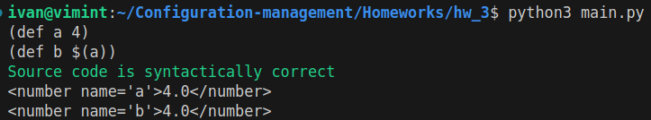
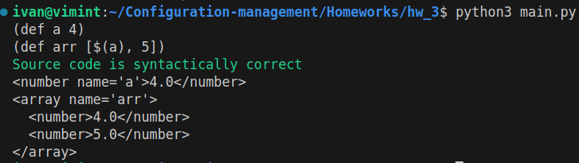
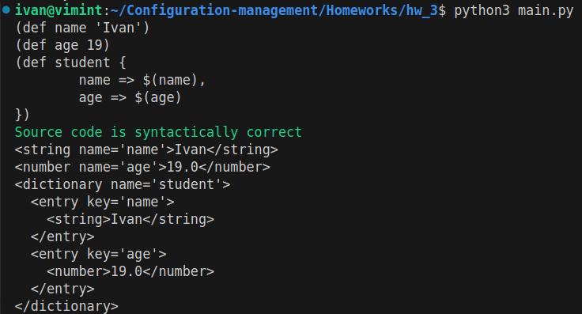
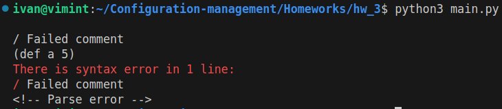
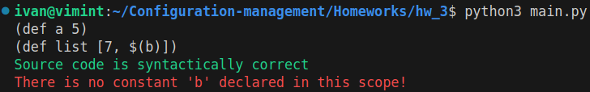
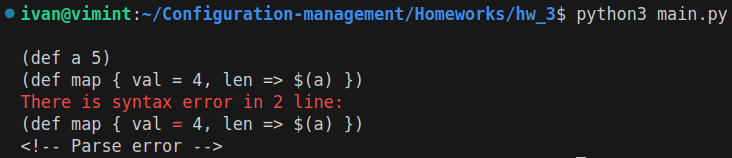
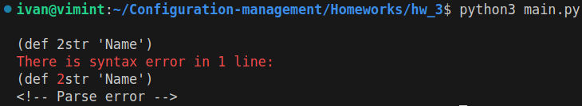

# Документация по домашнему заданию №3

## Формулировка задания

Разработать инструмент командной строки для учебного конфигурационного 
языка, синтаксис которого приведен далее. Этот инструмент преобразует текст из 
входного формата в выходной. Синтаксические ошибки выявляются с выдачей 
сообщений. 

Входной текст на учебном конфигурационном языке принимается из 
стандартного ввода. Выходной текст на языке xml попадает в стандартный вывод. 

Однострочные комментарии: 
```// Это однострочный комментарий```

Массивы: 
```[ значение, значение, значение, ... ]```

Словари: 
```
{ 
    имя => значение, 
    имя => значение, 
    имя => значение, 
    ... 
}
```

Имена: 
```[a-zA-Z][_a-zA-Z0-9]*```

Значения: 
* Числа. 
* Строки. 
* Массивы. 
* Словари. 

Строки: 
```'Это строка' ```

Объявление константы на этапе трансляции: 
```(def имя значение) ```

Вычисление константы на этапе трансляции: 
```$(имя) ```

Результатом вычисления константного выражения является значение. 
Все конструкции учебного конфигурационного языка (с учетом их 
возможной вложенности) должны быть покрыты тестами. Необходимо показать 3 
примера описания конфигураций из разных предметных областей.

## Взаимодействие с решением

### Установка

Наилучшим способом установки решения будет клонирование данного репозитория. Для этого нужно перейти в папку, в которую хотите сохранить данный репозиторий, и набрать в командной строке:

```bash
git clone https://github.com/MatheMateCS/Configuration-management.git
```

Решение будет лежать в папке "Homeworks/hw_3":

```bash
cd ./Homeworks/hw_3/
```

### Запуск

В качестве простейшего варианта запуск программы может производиться посредством исполняемого файла **run.bash**. 
```bash
./run.bash
```

По умолчанию скрипт **run.bash** запускает Python-скрипты командой python3, считая, что Python был добавлен в PATH. Если же на данном устройстве это не так, то в качестве аргумента к скрипту следует указать путь до интерпретатора Python.

Пример запуска скрипта с указанием пути до интерпретатора: 
```bash
./run.bash ~/AppData/Local/Programs/Python/Python312/python.exe
```
Программа получает код на конфигурационном языке из стандартного ввода. 

### Передача данных скрипту

Есть несколько способов передать информацию программе:

1. Запустить исполняемый файл: 
    ```bash
    ./run.bash
    ```
    И вводить необходимый код. По окончании ввода нажать комбинацию клавиш "Ctrl+D", что будет означать конец потока ввода.
2. Посредством конвейера перенаправить вывод иной программы или стандартный ввод на вход данному срипту, например:
    ```bash
    echo "..." | ./run.bash
    ```
3. Передать информацию из файла:
    ```bash
    cat program.txt | ./run.bash
    ```

### Тестирование

По аналогии с запуском основной программы есть вспомогательный скрипт запуска тестирования: test.bash. Он также может принимать путь до интерпретатора python.

```bash
./test.bash 
```

Если тестирование прошло успешно, то в консоли должно появиться сообщение вида:

```
Ran 9 tests in 0.021s

OK
```
### Примеры тестирования









## Примеры описания конфигураций

1. Хранение данных о пользователе:

```configuration-lang
(def user {
    username => 'John',
    email => 'john@example.com',
    password => 'john&123'
})
```

```xml
<configuration>
  <dictionary name='user'>
    <entry key='username'>
      <string>John</string>
    </entry>
    <entry key='email'>
      <string>john@example.com</string>
    </entry>
    <entry key='password'>
      <string>john&123</string>
    </entry>
  </dictionary>
</configuration>
```

2. Хранение информации о файлах проекта

```configuration-lang
// dependencies
(def peco {
    deps => '',
    type => '.py'
})
(def main {
    deps => ['peco'],
    type => '.py'
})
(def run {
    deps => ['main', 'python'],
    type => '.bash'
})
```

```xml
<configuration>
  <dictionary name='peco'>
    <entry key='deps'>
      <string></string>
    </entry>
    <entry key='type'>
      <string>.py</string>
    </entry>
  </dictionary>
  <dictionary name='main'>
    <entry key='deps'>
      <array>
        <string>peco</string>
      </array>
    </entry>
    <entry key='type'>
      <string>.py</string>
    </entry>
  </dictionary>
  <dictionary name='run'>
    <entry key='deps'>
      <array>
        <string>main</string>
        <string>python</string>
      </array>
    </entry>
    <entry key='type'>
      <string>.bash</string>
    </entry>
  </dictionary>
</configuration>
```

3. Описание поставок в магазине

```configuration-lang
// supplies
(def today '12.11.24')
(def tomato {
    amount => 40,
    date => $(today)
})
(def bread {
    amount => 20,
    date => $(today)
})
(def supply [$(tomato), $(bread)])
```

```xml
<configuration>
  <string name='today'>12.11.24</string>
  <dictionary name='tomato'>
    <entry key='amount'>
      <number>40.0</number>
    </entry>
    <entry key='date'>
      <string>12.11.24</string>
    </entry>
  </dictionary>
  <dictionary name='bread'>
    <entry key='amount'>
      <number>20.0</number>
    </entry>
    <entry key='date'>
      <string>12.11.24</string>
    </entry>
  </dictionary>
  <array name='supply'>
    <dictionary>
      <entry key='amount'>
        <number>40.0</number>
      </entry>
      <entry key='date'>
        <string>12.11.24</string>
      </entry>
    </dictionary>
    <dictionary>
      <entry key='amount'>
        <number>20.0</number>
      </entry>
      <entry key='date'>
        <string>12.11.24</string>
      </entry>
    </dictionary>
  </array>
</configuration>
```


